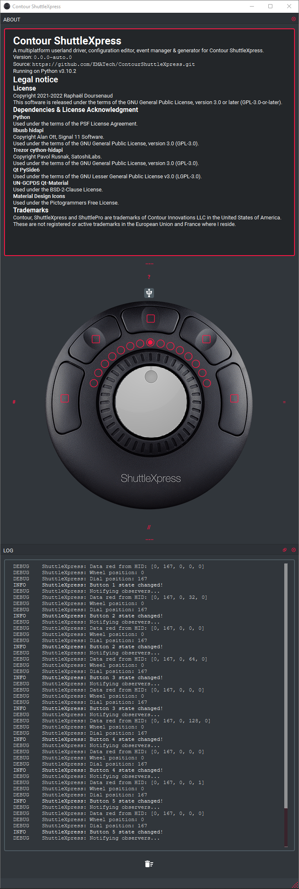

Contour ShuttleXpress
=====================

A multiplatform userland driver, configuration editor, event manager & generator for Contour ShuttleXpress.

Status
------

Proof of concept

Features
--------

- [ ] Platforms support
    - [ ] **(WIP)** Microsoft Windows
        - [ ] Run as a [windows service](http://thepythoncorner.com/dev/how-to-create-a-windows-service-in-python/) ?
        - [ ] Add configurator to control panel?
        - [ ] **(WIP)** Tray icon shortcut to configurator
    - [ ] Mac OS X
    - [ ] GNU/Linux
    - [ ] Android?
    - [ ] iOS/iPadOS?

- [x] Find and open device
    - [x] USB HID via hidapi

- [x] Decode raw values
    - [x] State management
    - [x] Observer pattern event hooks

- [ ] **(WIP)** Configurator (GUI)
    - [x] Qt
    - [X] Main window
    - [x] Icon
    - [x] Title
    - [x] System tray icon
    - [x] Display state graphically
    - [x] Status
        - [x] Connection
        - [x] Events
    - [x] ~~Menu?~~
    - [x] About window
    - [ ] Debug log
    - [ ] Configuration UI
        - [ ] Generate configurations
        - [ ] Load existing configurations
        - [ ] Write/Store configurations
    - [ ] Emulation when no hardware is connected
    - [ ] Separate
    - [ ] Custom graphical widgets?
        - [ ] Wheel (Rotating image with color tick)
        - [ ] Dial (Rotating image)
        - [ ] Button (Depict depressed state)

- [ ] Events generator (See Observers below)

- [ ] Configurations format support
    - [ ] Custom?
    - [ ] [Official driver configurations](https://contourdesign.fr/support/windows-shuttle-settings/)
        - [ ] Parse
        - [ ] Generate

### Events

- [x] State change events
    - [x] Buttons 1 to 5:
        - [x] press
        - [x] release
    - [x] Wheel:
        - [x] centered (position 0)
        - [x] position change (-7 to 7)
        - [x] direction: up
        - [x] direction: down
    - [x] Dial:
        - [x] direction: up
        - [x] direction: down

### Observers

- [x] GUI
    - [x] State
    - [x] Event names

- [ ] **(WIP)** Plugins system

- [ ] **(WIP)** generate keyboard strokes and/or modifiers
    - [x] ~~SendKeys?~~
    - [x] ~~pywin32 shell.SendKeys?~~
    - [ ] **(WIP)** pynput! (Also support mouse)
    - [ ] Frequency (Once/Hold…)

- [ ] **(WIP)** generate mouse events
    - [ ] **(WIP)** pynput! (Also support mouse)
    - [ ] click
    - [ ] wheel

- [ ] generate MIDI
    - [ ] Arbitrary (User defined)
    - [ ] MCU compatible
    - [ ] HUI compatible

- [ ] generate OSC

- [ ] call APIs?

- [ ] launch applications
    - ?

- [ ] per application profile
    - [ ] detect running application
        - [ ] Microsoft Windows
            - [ ] win32ui
        - [ ] Mac OS X
        - [ ] GNU/Linux
    - [ ] switch profile using buttons

- [ ] macros (generate multiple events)

- [ ] configuration comments

Similar and/or related projects
---------------------------

### [shuttlemidi](https://github.com/dg1psi/shuttlemidi)

Sends MIDI from the Shuttle Contour to SDR Console (Go, hidapi, loopmidi, Apache-2.0)

Development log
---------------

### Finding the right library for Microsoft Windows

#### Attempt 1

Using [pyUSB](https://pypi.org/project/pyusb/)

Can’t access device without a kernel driver.

Kernel driver has been generated using [libusb-win32](https://sourceforge.net/projects/libusb-win32/), but you need to
disable driver signature enforcement before installing.

The easier way is to use [Zadig](https://zadig.akeo.ie/).

#### Attempt 2

Using [pyWinUSB](https://pypi.org/project/pywinusb/)

Can get HID without driver installation on Microsoft Windows!

Let’s continue…

Success!

But...

#### Attempt 3

Using [cython-hidapi](https://pypi.org/project/hidapi/)

Crossplatform (Microsoft Windows, Mac OS X, GNU/Linux)

Success on Microsoft Windows without prior driver installation!
Hope it’s the same on other platforms.

### Building a GUI

#### PySide6 (QT6)

Prototype UI done

Legal notice
------------

### License

Copyright 2021-2022 Raphaël Doursenaud

This software is released under the terms of the GNU General Public License, version 3.0 or later (GPL-3.0-or-later).

See [LICENSE](LICENSE).

### Dependencies & License Acknowledgment

- [Python](https://python.org) v3.10  
  Used under the terms of the PSF License Agreement.
- libusb [hidapi](https://github.com/libusb/hidapi)  
  Copyright Alan Ott, Signal 11 Software.  
  Used under the terms of the GNU General Public License, version 3.0 (GPL-3.0).
- via Trezor [cython-hidapi](https://github.com/trezor/cython-hidapi)  
  Copyright Pavol Rusnak, SatoshiLabs.  
  Used under the terms of the GNU General Public License, version 3.0 (GPL-3.0).
- Qt [PySide6](https://www.pyside.org)  
  Used under the terms of the GNU Lesser General Public License v3.0 (LGPL-3.0).
- UN-GCPDS [Qt-Material](https://github.com/UN-GCPDS/qt-material)  
  Used under the BSD-2-Clause License.
- [Material Design Icons](https://materialdesignicons.com)  
  Used under the Pictogrammers Free License.

### Trademarks

Contour, ShuttleXpress and ShuttlePro are trademarks of Contour Innovations LLC in the United States of America.

These are not registered or active trademarks in the European Union and France where I reside.